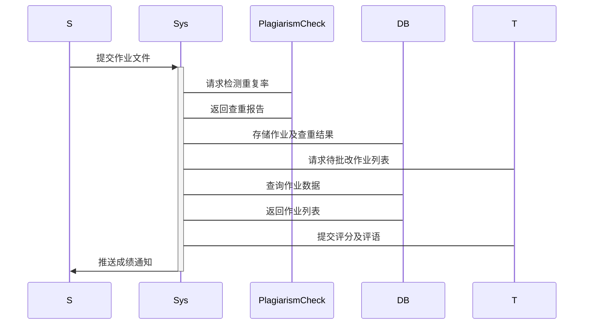

```mermaid
sequenceDiagram
S ->>+ Sys: 提交作业文件
Sys -> PlagiarismCheck: 请求检测重复率
PlagiarismCheck -> Sys: 返回查重报告
Sys -> DB: 存储作业及查重结果
T -> Sys: 请求待批改作业列表
Sys -> DB: 查询作业数据
DB -> Sys: 返回作业列表
T -> Sys: 提交评分及评语
Sys ->>- S: 推送成绩通知

```