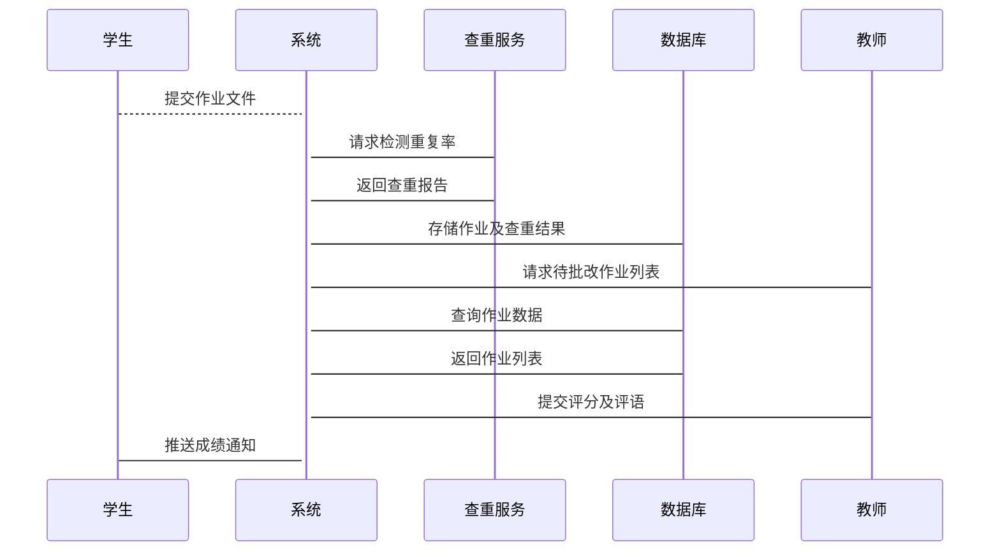

```mermaid
sequenceDiagram
学生 -->+ 系统: 提交作业文件
系统 -> 查重服务: 请求检测重复率
查重服务 -> 系统: 返回查重报告
系统 -> 数据库: 存储作业及查重结果
教师 -> 系统: 请求待批改作业列表
系统 -> 数据库: 查询作业数据
数据库 -> 系统: 返回作业列表
教师 -> 系统: 提交评分及评语
系统 -> 学生: 推送成绩通知

```