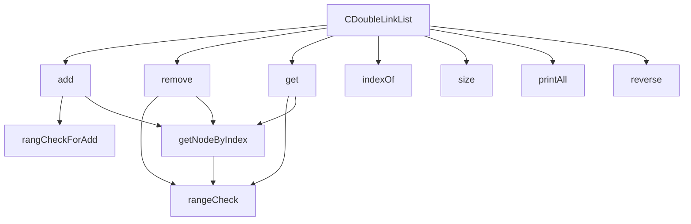

```mermaid
graph TD
    A[CDoubleLinkList] --> B[add]
    A --> C[remove]
    A --> D[get]
    A --> E[indexOf]
    A --> F[size]
    A --> G[printAll]
    A --> H[reverse]
    
    B --> I[rangCheckForAdd]
    B --> J[getNodeByIndex]
    C --> K[rangeCheck]
    C --> J
    D --> K
    D --> J
    J --> K
```