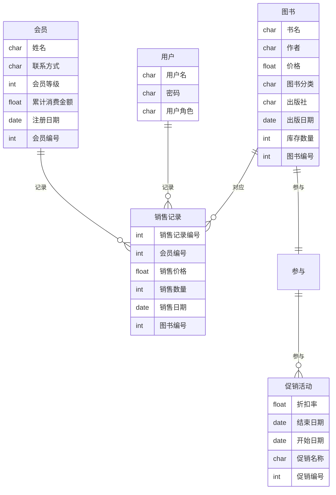

```mermaid
erDiagram
    会员 {
        char 姓名
        char 联系方式
        int 会员等级
        float 累计消费金额
        date 注册日期
        int 会员编号
    }
    图书 {
        char 书名
        char 作者
        float 价格
        char 图书分类
        char 出版社
        date 出版日期
        int 库存数量
        int 图书编号
    }
    销售记录 {
        int 销售记录编号
        int 会员编号
        float 销售价格
        int 销售数量
        date 销售日期
        int 图书编号
    }
    用户 {
        char 用户名
        char 密码
        char 用户角色
    }
    促销活动 {
        float 折扣率
        date 结束日期
        date 开始日期
        char 促销名称
        int 促销编号
    }

    会员 ||--o{ 销售记录 : 记录
    用户 ||--o{ 销售记录 : 记录
    图书 ||--o{ 销售记录 : 对应
    图书 ||--|| 参与 : 参与
    参与 ||--o{ 促销活动 : 参与
```