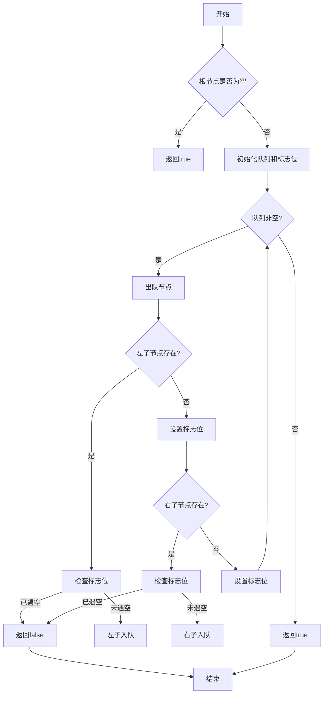

```mermaid
graph TD
    A[开始] --> B{根节点是否为空}
    B -->|是| C[返回true]
    B -->|否| D[初始化队列和标志位]
    D --> E{队列非空?}
    E -->|是| F[出队节点]
    F --> G{左子节点存在?}
    G -->|是| H[检查标志位]
    H -->|已遇空| I[返回false]
    H -->|未遇空| J[左子入队]
    G -->|否| K[设置标志位]
    K --> L{右子节点存在?}
    L -->|是| M[检查标志位]
    M -->|已遇空| I
    M -->|未遇空| N[右子入队]
    L -->|否| O[设置标志位]
    O --> E
    E -->|否| P[返回true]
    I --> Q[结束]
    P --> Q
```