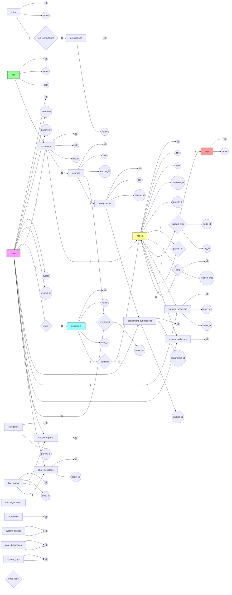

```mermaid
flowchart LR
  %% === Entities (矩形) ===
  users[users]
  roles[roles]
  permissions[permissions]
  notebooks[notebooks]
  nodes[nodes]
  tags[tags]
  files[files]
  courses[courses]
  categories[categories]
  resources[resources]
  assignments[assignments]
  ai_models[ai_models]
  learning_behaviors[learning_behaviors]
  recommendations[recommendations]
  assignments_sub[assignment_submissions]
  course_students_table[course_students]
  live_rooms[live_rooms]
  chat_messages[chat_messages]
  live_participants[live_participants]
  system_configs[system_configs]
  data_dictionaries[data_dictionaries]
  system_logs[system_logs]

  %% === Relationship diamonds (菱形) ===
  rel_users_notebooks{owns}
  rel_notebooks_nodes{contains}
  rel_nodes_parent{parent_of}
  rel_nodes_links{links}
  rel_nodes_tags{tagged_with}
  rel_roles_permissions{role_permissions}
  rel_course_students{enrollment}
  rel_node_tags_table{node_tags}

  %% === Attributes (椭圆)，主键下划线用 <u>id</u> ===
  users_id((<u>id</u>))
  users_username((username))
  users_password((password))
  users_avatar((avatar))
  users_created_at((created_at))

  roles_id((<u>id</u>))
  roles_name((name))

  permissions_id((<u>id</u>))
  permissions_name((name))

  notebooks_id((<u>id</u>))
  notebooks_name((name))
  notebooks_user_id((user_id))

  nodes_id((<u>id</u>))
  nodes_title((title))
  nodes_type((type))
  nodes_notebook_id((notebook_id))
  nodes_parent_id((parent_id))

  tags_id((<u>id</u>))
  tags_name((name))

  files_id((<u>id</u>))
  files_name((name))
  files_path((path))

  courses_id((<u>id</u>))
  courses_title((title))
  courses_teacher_id((teacher_id))

  categories_id((<u>id</u>))
  categories_parent_id((parent_id))

  resources_id((<u>id</u>))
  resources_title((title))
  resources_file_id((file_id))

  assignments_id((<u>id</u>))
  assignments_title((title))
  assignments_course_id((course_id))

  assignment_sub_id((<u>id</u>))
  assignment_sub_assignment_id((assignment_id))
  assignment_sub_student_id((student_id))

  ai_models_id((<u>id</u>))
  learning_behaviors_id((<u>id</u>))
  learning_behaviors_user_id((user_id))
  learning_behaviors_node_id((node_id))

  recommendations_id((<u>id</u>))
  live_rooms_id((<u>id</u>))
  live_rooms_host_id((host_id))

  chat_messages_id((<u>id</u>))
  chat_messages_room_id((room_id))

  live_participants_id((<u>id</u>))

  system_configs_id((<u>id</u>))
  data_dictionaries_id((<u>id</u>))
  system_logs_id((<u>id</u>))

  %% === Relationship attributes (联系的属性) ===
  rel_links_id((<u>id</u>))
  rel_links_type((relation_type))
  rel_node_tags_node_id((node_id))
  rel_node_tags_tag_id((tag_id))
  rel_course_students_progress((progress))

  %% === Connect attributes to entities ===
  users --> users_id
  users --> users_username
  users --> users_password
  users --> users_avatar
  users --> users_created_at

  roles --> roles_id
  roles --> roles_name

  permissions --> permissions_id
  permissions --> permissions_name

  notebooks --> notebooks_id
  notebooks --> notebooks_name
  notebooks --> notebooks_user_id

  nodes --> nodes_id
  nodes --> nodes_title
  nodes --> nodes_type
  nodes --> nodes_notebook_id
  nodes --> nodes_parent_id

  tags --> tags_id
  tags --> tags_name

  files --> files_id
  files --> files_name
  files --> files_path

  courses --> courses_id
  courses --> courses_title
  courses --> courses_teacher_id

  categories --> categories_id
  categories --> categories_parent_id

  resources --> resources_id
  resources --> resources_title
  resources --> resources_file_id

  assignments --> assignments_id
  assignments --> assignments_title
  assignments --> assignments_course_id

  assignments_sub --> assignment_sub_id
  assignments_sub --> assignment_sub_assignment_id
  assignments_sub --> assignment_sub_student_id

  ai_models --> ai_models_id
  learning_behaviors --> learning_behaviors_id
  learning_behaviors --> learning_behaviors_user_id
  learning_behaviors --> learning_behaviors_node_id

  recommendations --> recommendations_id

  live_rooms --> live_rooms_id
  live_rooms --> live_rooms_host_id

  chat_messages --> chat_messages_id
  chat_messages --> chat_messages_room_id

  live_participants --> live_participants_id

  system_configs --> system_configs_id
  data_dictionaries --> data_dictionaries_id
  system_logs --> system_logs_id

  %% === Connect entities to relationship diamonds with cardinalities ===
  users -- "1" --> rel_users_notebooks
  rel_users_notebooks -- "N" --> notebooks

  notebooks -- "1" --> rel_notebooks_nodes
  rel_notebooks_nodes -- "N" --> nodes

  nodes -- "1" --> rel_nodes_parent
  rel_nodes_parent -- "N" --> nodes

  %% links: represent relationship between nodes; links (table) has attributes id and relation_type
  nodes -- "1" --> rel_nodes_links
  rel_nodes_links -- "N" --> nodes
  rel_nodes_links --> rel_links_id
  rel_nodes_links --> rel_links_type

  %% node-tags many-to-many
  nodes -- "N" --> rel_nodes_tags
  rel_nodes_tags -- "N" --> tags
  rel_nodes_tags --> rel_node_tags_node_id
  rel_nodes_tags --> rel_node_tags_tag_id

  %% role-permission many-to-many
  roles -- "1" --> rel_roles_permissions
  rel_roles_permissions -- "N" --> permissions

  %% course enrollment (course_students)
  courses -- "1" --> rel_course_students
  rel_course_students -- "N" --> users
  rel_course_students --> rel_course_students_progress

  %% resources -> files and courses and nodes and users
  files -- "1" --> resources
  resources -- "N" --> courses
  resources -- "N" --> nodes
  users -- "1" --> resources

  %% assignments relations
  courses -- "1" --> assignments
  assignments -- "N" --> assignments_sub
  users -- "1" --> assignments_sub

  %% learning_behaviors and recommendations link to users & nodes
  users -- "1" --> learning_behaviors
  nodes -- "1" --> learning_behaviors
  users -- "1" --> recommendations
  nodes -- "1" --> recommendations

  %% live rooms and participants/messages
  live_rooms -- "1" --> live_participants
  users -- "1" --> live_participants
  live_rooms -- "1" --> chat_messages
  users -- "1" --> chat_messages

  %% system tables (config, dict, logs)
  system_configs --> system_configs_id
  data_dictionaries --> data_dictionaries_id
  system_logs --> system_logs_id

  style users fill:#f9f,stroke:#333,stroke-width:1px
  style nodes fill:#ff9,stroke:#333,stroke-width:1px
  style notebooks fill:#9ff,stroke:#333,stroke-width:1px
  style tags fill:#f99,stroke:#333,stroke-width:1px
  style files fill:#9f9,stroke:#333,stroke-width:1px
```