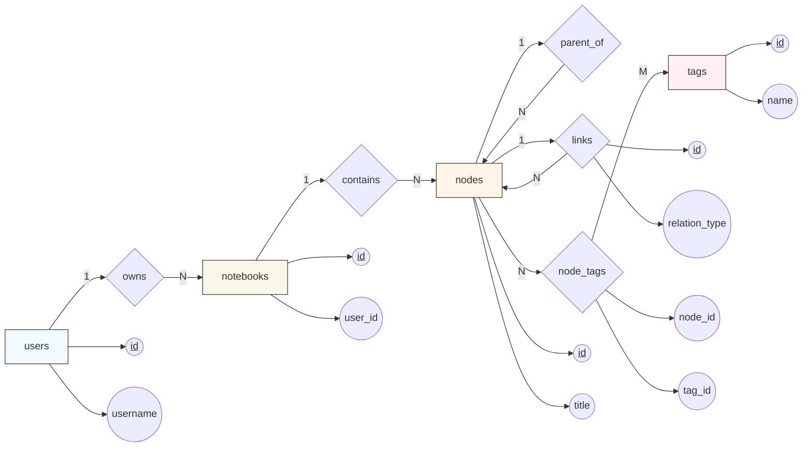

```mermaid
flowchart LR
  %% === 简化实体（矩形） ===
  Users[users]
  Notebooks[notebooks]
  Nodes[nodes]
  Tags[tags]

  %% === 简化联系（菱形） ===
  rel_owns{owns}
  rel_contains{contains}
  rel_parent{parent_of}
  rel_links{links}
  rel_node_tags{node_tags}

  %% === 属性（椭圆），主键下划线标注 ===
  Users_id((<u>id</u>))
  Users_username((username))

  Notebooks_id((<u>id</u>))
  Notebooks_user_id((user_id))

  Nodes_id((<u>id</u>))
  Nodes_title((title))

  Tags_id((<u>id</u>))
  Tags_name((name))

  rel_links_id((<u>id</u>))
  rel_links_type((relation_type))

  rel_node_tags_node_id((node_id))
  rel_node_tags_tag_id((tag_id))

  %% === 实体与其属性连接（直线） ===
  Users --> Users_id
  Users --> Users_username

  Notebooks --> Notebooks_id
  Notebooks --> Notebooks_user_id

  Nodes --> Nodes_id
  Nodes --> Nodes_title

  Tags --> Tags_id
  Tags --> Tags_name

  %% === 联系与其属性连接 ===
  rel_links --> rel_links_id
  rel_links --> rel_links_type

  rel_node_tags --> rel_node_tags_node_id
  rel_node_tags --> rel_node_tags_tag_id

  %% === 实体与联系之间连线并标注基数 ===
  %% users 1 - N notebooks
  Users -- "1" --> rel_owns
  rel_owns -- "N" --> Notebooks

  %% notebooks 1 - N nodes
  Notebooks -- "1" --> rel_contains
  rel_contains -- "N" --> Nodes

  %% nodes 1 - N nodes (parent-child)
  Nodes -- "1" --> rel_parent
  rel_parent -- "N" --> Nodes

  %% nodes 1 - N nodes via links (links as联系，含 relation_type)
  Nodes -- "1" --> rel_links
  rel_links -- "N" --> Nodes

  %% nodes N - M tags via node_tags（多对多，两侧标注 N 和 M）
  Nodes -- "N" --> rel_node_tags
  rel_node_tags -- "M" --> Tags

  %% 风格（可选）
  style Users fill:#f2f9ff,stroke:#333,stroke-width:1px
  style Notebooks fill:#f9f7e8,stroke:#333,stroke-width:1px
  style Nodes fill:#fff5e6,stroke:#333,stroke-width:1px
  style Tags fill:#fff0f5,stroke:#333,stroke-width:1px
```