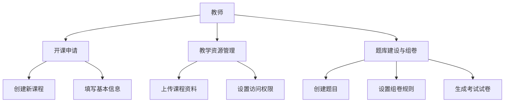

```mermaid
graph TD
    T[教师] --> T1[开课申请]
    T --> T2[教学资源管理]
    T --> T3[题库建设与组卷]
    T1 --> T11[创建新课程]
    T1 --> T12[填写基本信息]
    T2 --> T21[上传课程资料]
    T2 --> T22[设置访问权限]
    T3 --> T31[创建题目]
    T3 --> T32[设置组卷规则]
    T3 --> T33[生成考试试卷]
```