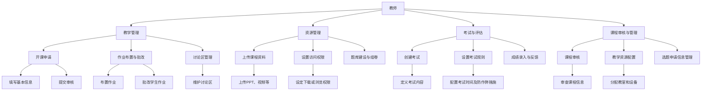

```mermaid
graph TD
    T[教师] --> TM[教学管理]
    T --> RM[资源管理]
    T --> EM[考试与评估]
    T --> CM[课程审核与管理]
    
    TM --> TM1[开课申请]
    TM --> TM2[作业布置与批改]
    TM --> TM3[讨论区管理]

    RM --> RM1[上传课程资料]
    RM --> RM2[设置访问权限]
    RM --> RM3[题库建设与组卷]

    EM --> EM1[创建考试]
    EM --> EM2[设置考试规则]
    EM --> EM3[成绩录入与反馈]

    CM --> CM1[课程审核]
    CM --> CM2[教学资源配置]
    CM --> CM3[选题申请信息管理]

    TM1 --> TM11[填写基本信息]
    TM1 --> TM12[提交审核]
    TM2 --> TM21[布置作业]
    TM2 --> TM22[批改学生作业]
    TM3 --> TM31[维护讨论区]
    RM1 --> RM11[上传PPT、视频等]
    RM2 --> RM21[设定下载或浏览权限]
    EM1 --> EM11[定义考试内容]
    EM2 --> EM21[配置考试时间及防作弊措施]
    CM1 --> CM11[审查课程信息]
    CM2 --> CM21[分配教室和设备]
```