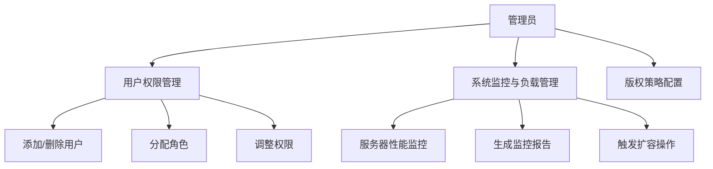

```mermaid
graph TD
    A[管理员] --> B[用户权限管理]
    A --> C[系统监控与负载管理]
    A --> D[版权策略配置]
    B --> B1[添加/删除用户]
    B --> B2[分配角色]
    B --> B3[调整权限]
    C --> C1[服务器性能监控]
    C --> C2[生成监控报告]
    C --> C3[触发扩容操作]
```