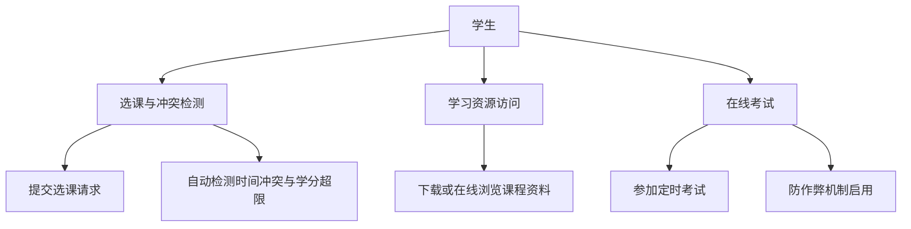

```mermaid
graph TD
    S[学生] --> S1[选课与冲突检测]
    S --> S2[学习资源访问]
    S --> S3[在线考试]
    S1 --> S11[提交选课请求]
    S1 --> S12[自动检测时间冲突与学分超限]
    S2 --> S21[下载或在线浏览课程资料]
    S3 --> S31[参加定时考试]
    S3 --> S32[防作弊机制启用]
```