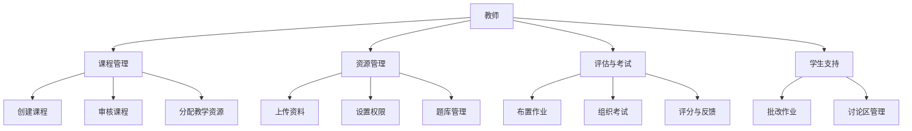

```mermaid
graph TD
    Teacher[教师] --> CourseManagement[课程管理]
    Teacher --> ResourceManagement[资源管理]
    Teacher --> Assessment[评估与考试]
    Teacher --> StudentSupport[学生支持]

    CourseManagement --> CreateCourse[创建课程]
    CourseManagement --> ReviewCourse[审核课程]
    CourseManagement --> AllocateResources[分配教学资源]

    ResourceManagement --> UploadMaterials[上传资料]
    ResourceManagement --> SetPermissions[设置权限]
    ResourceManagement --> ManageQuestions[题库管理]

    Assessment --> AssignHomework[布置作业]
    Assessment --> ConductExams[组织考试]
    Assessment --> GradeFeedback[评分与反馈]

    StudentSupport --> CorrectAssignments[批改作业]
    StudentSupport --> ForumManagement[讨论区管理]
```