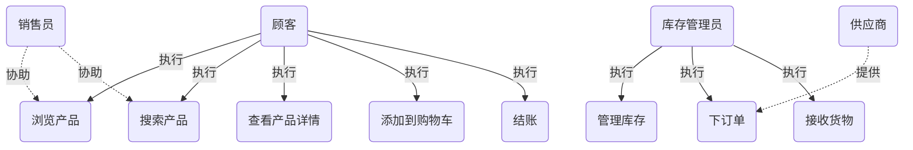

```mermaid
%% 用例图
graph TD
    %% 参与者
    Customer(顾客)
    Salesperson(销售员)
    InventoryManager(库存管理员)
    Supplier(供应商)

    %% 用例
    BrowseProducts(浏览产品)
    SearchProducts(搜索产品)
    ViewProductDetails(查看产品详情)
    AddToCart(添加到购物车)
    Checkout(结账)
    ManageInventory(管理库存)
    PlaceOrder(下订单)
    ReceiveGoods(接收货物)

    %% 关系
    Customer -->|执行| BrowseProducts
    Customer -->|执行| SearchProducts
    Customer -->|执行| ViewProductDetails
    Customer -->|执行| AddToCart
    Customer -->|执行| Checkout
    InventoryManager -->|执行| ManageInventory
    InventoryManager -->|执行| PlaceOrder
    InventoryManager -->|执行| ReceiveGoods
    Supplier -.->|提供| PlaceOrder
    Salesperson .->|协助| BrowseProducts
    Salesperson .->|协助| SearchProducts
```