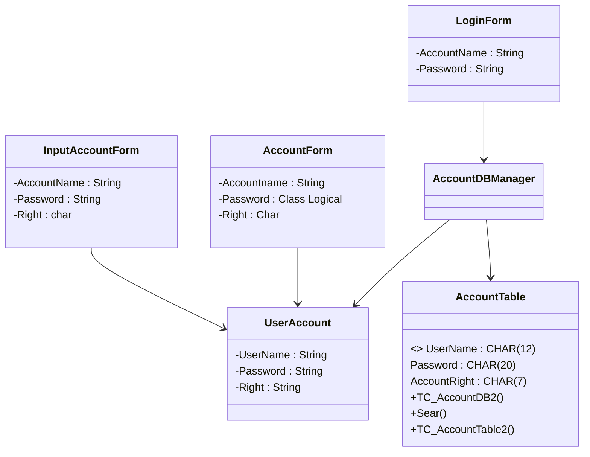

```mermaid
classDiagram
    class InputAccountForm {
        -AccountName : String
        -Password : String
        -Right : char
    }
    class UserAccount {
        -UserName : String
        -Password : String
        -Right : String
    }
    class AccountForm {
        -Accountname : String
        -Password : Class Logical
        -Right : Char
    }
    class LoginForm {
        -AccountName : String
        -Password : String
    }
    class AccountDBManager {
    }
    class AccountTable {
        <<PK>> UserName : CHAR(12)
        Password : CHAR(20)
        AccountRight : CHAR(7)
        +TC_AccountDB2()
        +Sear()
        +TC_AccountTable2()
    }

    InputAccountForm --> UserAccount
    AccountForm --> UserAccount
    LoginForm --> AccountDBManager
    AccountDBManager --> UserAccount
    AccountDBManager --> AccountTable
```