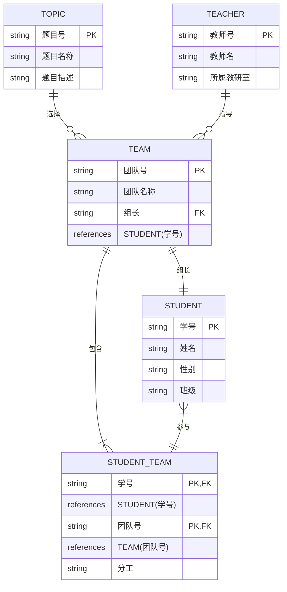

```mermaid
erDiagram
    TOPIC ||--o{ TEAM : "选择"
    TEAM ||--|{ STUDENT_TEAM : "包含"
    STUDENT }|--|| STUDENT_TEAM : "参与"
    TEAM ||--|| STUDENT : "组长"
    TEACHER ||--o{ TEAM : "指导"
    STUDENT {
        string 学号 PK
        string 姓名
        string 性别
        string 班级
    }
    TEAM {
        string 团队号 PK
        string 团队名称
        string 组长 FK references STUDENT(学号)
    }
    TOPIC {
        string 题目号 PK
        string 题目名称
        string 题目描述
    }
    TEACHER {
        string 教师号 PK
        string 教师名
        string 所属教研室
    }
    STUDENT_TEAM {
        string 学号 PK, FK references STUDENT(学号)
        string 团队号 PK, FK references TEAM(团队号)
        string 分工
    }
```