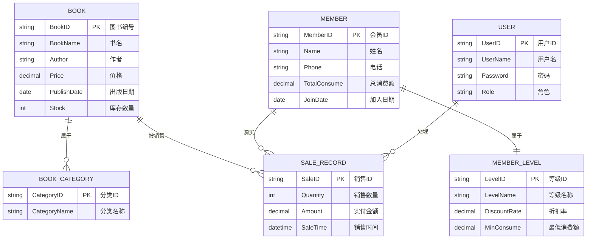

```mermaid
erDiagram
    BOOK ||--o{ BOOK_CATEGORY : "属于"
    BOOK ||--o{ SALE_RECORD : "被销售"
    MEMBER ||--o{ SALE_RECORD : "购买"
    MEMBER ||--|| MEMBER_LEVEL : "属于"
    USER ||--o{ SALE_RECORD : "处理"
    
    BOOK {
        string BookID PK "图书编号"
        string BookName "书名"
        string Author "作者"
        decimal Price "价格"
        date PublishDate "出版日期"
        int Stock "库存数量"
    }
    
    BOOK_CATEGORY {
        string CategoryID PK "分类ID"
        string CategoryName "分类名称"
    }
    
    MEMBER {
        string MemberID PK "会员ID"
        string Name "姓名"
        string Phone "电话"
        decimal TotalConsume "总消费额"
        date JoinDate "加入日期"
    }
    
    MEMBER_LEVEL {
        string LevelID PK "等级ID"
        string LevelName "等级名称"
        decimal DiscountRate "折扣率"
        decimal MinConsume "最低消费额"
    }
    
    SALE_RECORD {
        string SaleID PK "销售ID"
        int Quantity "销售数量"
        decimal Amount "实付金额"
        datetime SaleTime "销售时间"
    }
    
    USER {
        string UserID PK "用户ID"
        string UserName "用户名"
        string Password "密码"
        string Role "角色"
    }
```